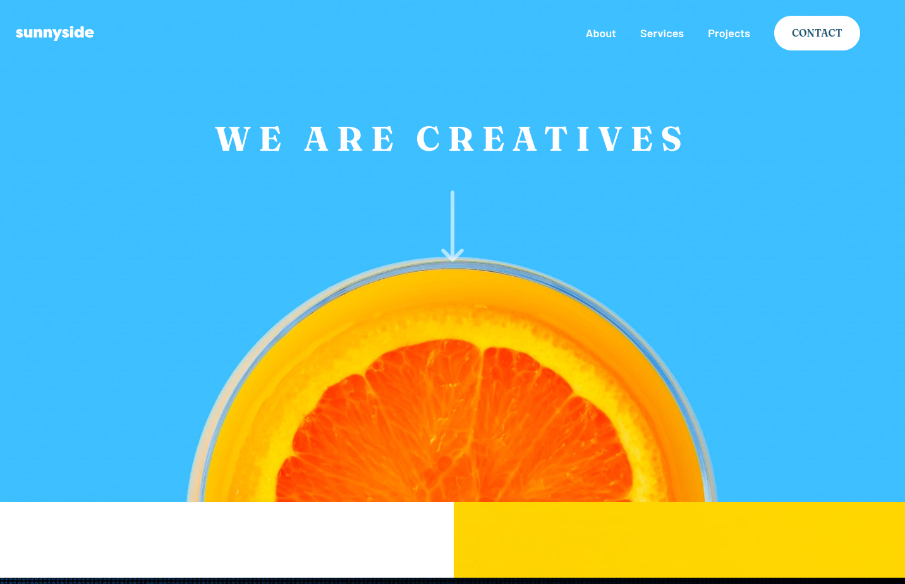

# Frontend Mentor - Sunnyside agency landing page solution

This is a solution to the [Sunnyside agency landing page challenge on Frontend Mentor](https://www.frontendmentor.io/challenges/sunnyside-agency-landing-page-7yVs3B6ef). Frontend Mentor challenges help you improve your coding skills by building realistic projects.

## Table of contents

- [Overview](#overview)
  - [The challenge](#the-challenge)
  - [Screenshot](#screenshot)
  - [Links](#links)
- [My process](#my-process)
  - [Built with](#built-with)
  - [What I learned](#what-i-learned)
  - [Useful resources](#useful-resources)
- [Author](#author)
- [Tags](#tags)


## Overview

### The challenge

Users should be able to:

- View the optimal layout for the site depending on their device's screen size
- See hover states for all interactive elements on the page

### Screenshot




### Links

- Solution URL: [Add live site URL here](https://your-live-site-url.com)
- [Live Site URL](https://sunny-side-landingpage-frontendmentor.netlify.app/)

## My process

### Built with

- Mobile-first workflow
- Semantic HTML5 markup
- Flexbox
- CSS Grid
- vite
- npm
- BuilT in Browser: Google Chrome
- Browser Extension: Perfect Pixel


### Code Snippets

```html
  <!-- setction gallery -->
    <section class="gallery_grid_ctn">
      <div class="gallery_child"></div>
      <div class="gallery_child"></div>
      <div class="gallery_child"></div>
      <div class="gallery_child"></div>
    </section>
```

```css
 /* grid gallery section */
  .gallery_grid_ctn {

    display: grid;
    grid-template-columns: 1fr 1fr;
    grid-template-rows: 1fr 1fr;
    gap: 0px 0px;
    grid-auto-flow: row;
    grid-template-areas:
      "milk"
      "orange"
      "coan"
      "sugar"
    ;

    width: 100vw;
    height: 50vh;
  }
```

```js
// hamburger menu logic
const hamburger = document.getElementById('hamburger')
let menu = document.getElementById('menu')

// only show menu on mobile
window.onload = () => {
    if (window.innerWidth < 430) {
        menu.style.display = 'none'
    }
}

// toggle menu
hamburger.addEventListener('click', () => {

    if (menu.style.display === 'none') {
        menu.style.display = 'block'
    } else {
        menu.style.display = 'none'
    }

})

```

### Useful resources

- [Scale svg](https://css-tricks.com/scale-svg/) - This helped me for scaling svg inline or as background image.

## Author

- Website - [Portfolio](https://cipivlad.github.io/myportfoliosite/)
- Frontend Mentor - [@CipiVlad](https://www.frontendmentor.io/profile/CipiVlad)
- DEV.to [https://dev.to/cipivlad](https://dev.to/cipivlad)

## Tags

#css, #grid, #flexbox, #github-pages, #vite
